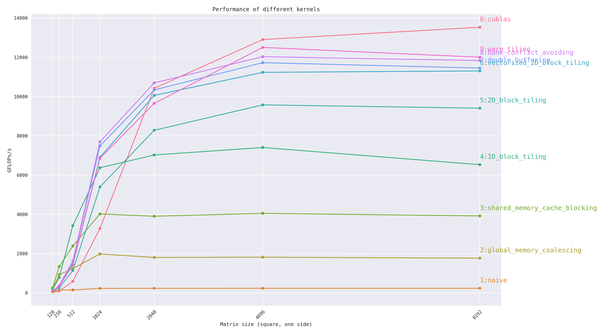
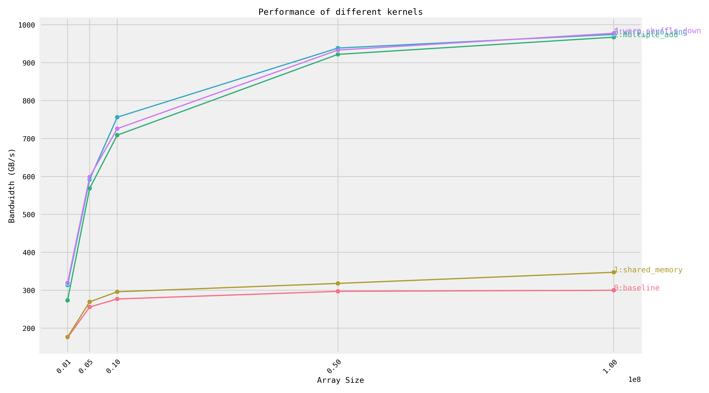

## Introduction

When I was self-learning CUDA programming, I found that it is necessary to work under an environment that manages and compiles the kernels efficiently. So I built up this repository under the inspiration of several other repositories on github, especially [SGEMM_CUDA](https://github.com/siboehm/SGEMM_CUDA).


## Usage

To efficiently develop, test and benchmark kernerls over different tasks, the project contains multiple similar folders under the root directory, each corresponding to a computational task (gemm, reduce, etc..).

The usage of API is common between these tasks, so in the following sections, `task` will refer to any task implemented in this project. To explain the usage clearly, the GEMM example is also displayed for each API.

Currently implemented tasks include [`gemm`, `reduce`], and `task` should be one of them.

### Compile

To compile, run the following commands:
```bash
mkdir build
cd build
cmake ..
make [task]
```

#### Example
If you want to generate kernels on GEMM matrix multiplication, then run
```bash
make gemm
```
to generate an executable file `gemm` that contains all the compiled GEMM Cuda kernels.

### List valid kernels

To display the list of all valid kernels along with their ids:
```bash
./[task] --list-kernels
```

Valid kernels should be registered in the list `registered_kernel` of `/config.h` under the task folder.

#### Example
To list all the implemented GEMM kernels, run
```bash
./gemm --list-kernels
```
The output looks like
```bash
Kernel 0: cublas
Kernel 1: naive
Kernel 2: global_memory_coalescing
Kernel 3: shared_memory_cache_blocking
Kernel 4: 1D_block_tiling
Kernel 5: 2D_block_tiling
Kernel 6: vectorized_2D_block_tiling
Kernel 7: double_buffering
Kernel 8: bank_conflict_avoiding
Kernel 9: warp_tiling
```

### Test correctness and performance of kernel(s)

In this code repository, we provide feature for testing the correctness and performance(latency) for all tasks.

The correctness check will compare the output of written kernel against the correct result obtained from naive method. Only after passing the correctness check, the performance check will profile the latency and related metric (GFLOPS for compute-bound kernel/bandwitdth for IO-bound kernel) through triggering the kernel for multiple times.

To do the tests, first set the input sizes in file `[task]/config.h`, and compile again.

Then, dependent on whether you want to test the correctness and performance on all kernels or one of them:

To run tests on all implemented kernels, execute

```bash
DEVICE=[device_id] ./[task]
```
Here the device_id of gpu is 0 by default.

To run tests on one specific kerenel, execute
```bash
DEVICE=[device_id] ./[task] [kernel_idx]
```
Here the kernel_idx should be valid. The idx of each kernel can be looked through `--list-kernels` flag.


#### Example

To test on GEMM kernels, first modify the `mnk_list` variable under `gemm/config.h`. `mnk_list` contains the sizes of tested matrices. Then do the compilation.

If all GEMM kernels are tested, execute
```bash
DEVICE=[device_id] ./gemm
```

If a specific GEMM kerenel is tested, execute
```bash
DEVICE=[device_id] ./gemm [kernel_idx]
```

### Trigger kernel once without testing

Sometimes we only want to trigger a kernel once. In such cases, you can trigger the kernel once through sending a `--once` flag and the sizes of inputs:
```bash
DEVICE=[device_id] ./[task] --once [kernel_idx] [Input Size Arguments]
```

The number of arguments for input sizes might vary in different tasks. In gemm task, three arguments are needed to describe the sizes of input matrices: `M`, `N`, `K`. However in reduce task, only the length `N` of input array is needed.

#### Example

Trigger a GEMM kernel once:
```bash
DEVICE=[device_id] ./gemm --once [kernel_idx] [M] [N] [K]
```

When using nsight compute to profile a kernel, just run following command:
```bash
DEVICE=[device_id] ncu -o profile ./gemm --once [kernel_idx] [M] [N] [K]
```

### Plot the profiling results of all kernels:

First move into the build directory, and run profiling on all kernels:
```bash
cd ./build
DEVICE=[device_id] ./[task] > result.log
```

Then move to the root directory of repository, execute
```bash
pip install -r requirements.txt
python [task]/plot_results.py --log_path ./build/result.log --plot_path [OUTPUT_DIRECTORY]/benchmark_result.png
```

Then the plot should appear at the given output path.

#### Example

After moving to the root directory of repo, the following script first profiles all the GEMM kernels, and then plots the result as file `benchmark_result.png` under current folder.

```bash
cd ./build
DEVICE=0 ./gemm > result.log
cd ..
pip install -r requirements.txt
python gemm/plot_results.py --log_path ./build/result.log --plot_path ./benchmark_result.png
```


### Add a new kernel

This framework supports flexible addition of newly implemented kernels. Here we focus on the addtion of new GEMM kernels.

Suppose the name of new kernel is `kenrel_x`, and the cuda header file containing the implementation is `kernel_x.cuh`.

Step 1: Put the `kernel_x.cuh` under the folder `gemm/kernels`.

Step 2: Include `kernel_x.cuh` in `gemm/kernels.cuh`.

Step 3:  In `gemm/runner.cuh`, add a new runner function `run_kernel_x_gemm` that launches the kernel properly.

Step 4: In `gemm/runner.cuh`, register the new kernel in function `run_kernel` by inserting following codes:
```C++
bool run_kernel(...) {
    ...
    if (kernel == "kernel_x") {
        run_kernel_x_gemm(A, B, C, m, n, k);
        valid_kernel = true;
    }
    ...
}
```

Step 5: In `gemm/configs.h`, register the new kernel through appending "kernel_x" to the list `registered_kernel`.

Now you can trigger the kernel through the methods described above.

For other tasks, the method of adding kernel is similar since the folder structure is the same.


## Benchmark

### GEMM

Results of each kernel running GEMM in different sizes (from 128 to 16384) on NVIDIA Tesla V100-PCIE-32GB with 16.4 TFLOPS computing capacity:
<!-- benchmark_plot -->

<!-- benchmark_plot -->

The following are each kernel's performance of running 4096x4096 GEMM on Nvidia Tesla V100-PCIE-32GB:

<!-- benchmark_results -->
|Idx| Kernel                           |  GFLOPs/s | Performance relative to cuBLAS |
|:--|----------------------------------|----------:|:-------------------------------|
| 1 | Naive                            |   `228.7` | 1.77%                          |
| 2 | Global Memory Coalescing         |  `1812.6` | 14.05%                         |
| 3 | Shared Memory Cache Blocking     |  `4045.3` | 31.40%                         |
| 4 | 1D Block Tiling                  |  `7399.9` | 57.36%                         |
| 5 | 2D Block Tiling                  |  `9571.4` | 74.20%                         |
| 6 | Vectorized 2D Block Tiling       | `11228.9` | 87.05%                         |
| 7 | Double Buffering                 | `11722.1` | 90.87%                         |
| 8 | Bank Conflict Avoiding           | `12025.9` | 93.23%                         |
| 9 | Warp Tiling                      | `12498.6` | 96.89%                         |
| 0 | cuBLAS                           | `12899.8` | 100.00%                        |
<!-- benchmark_results -->

### Reduce

Results of running reduction kernels on different input array lengths (from 1e6 to 1e8) on NVIDIA Tesla V100-PCIE-32GB:

<!-- benchmark_plot -->

<!-- benchmark_plot -->

The following are each kernel's performance of reducing 1e8 length array on Nvidia Tesla V100-PCIE-32GB with 1134 GB/s bandwidth:

<!-- benchmark_results -->
|Idx| Kernel                           |  Bandwidth(GB/s) | Utility of Bandwidth           |
|:--|----------------------------------|-----------------:|:-------------------------------|
| 0 | Baseline                         |  `300.0`         | 26.46%                         |
| 1 | Shared Memory                    |  `347.5`         | 30.64%                         |
| 2 | Multiple Add                     |  `967.29`        | 85.30%                         |
| 3 | Warp Unrolling                   |  `974.55`        | 85.94%                         |
| 4 | Warp Shuffle Down                |  `977.69`        | 86.22%                         |
<!-- benchmark_results -->


## Reference

### Nvidia Documents
[Cuda C++ Programming Guide](https://docs.nvidia.com/cuda/cuda-c-programming-guide/index.html)

[Cuda C++ Best Practices Guide](https://docs.nvidia.com/cuda/cuda-c-best-practices-guide/)

[Nvidia Cutlass Blog](https://developer.nvidia.com/blog/cutlass-linear-algebra-cuda/)

[Matrix Multiplication Background User's Guide](https://docs.nvidia.com/deeplearning/performance/dl-performance-matrix-multiplication/index.html)

[Optimizing Parallel Reduction in Cuda](https://developer.download.nvidia.cn/assets/cuda/files/reduction.pdf)

### Github Projects

[SGEMM_CUDA](https://github.com/siboehm/SGEMM_CUDA) by [siboehm](https://github.com/siboehm) (This tutorial is really awesome!)

[Cuda Tutorial](https://cuda.keter.top/) by [PaddleJitLab](https://github.com/PaddleJitLab)

[cuda-sgemm-optimization](https://github.com/YangLinzhuo/cuda-sgemm-optimization) by [yanglinzhuo](https://github.com/YangLinzhuo)

[Cuda Learning Material](https://github.com/ifromeast/cuda_learning.git) by [ifromeast](https://github.com/ifromeast)

[How_to_optimize_in_GPU](https://github.com/Liu-xiandong/How_to_optimize_in_GPU) by [Liu-xiandong](https://github.com/Liu-xiandong)

[how-to-optim-algorithm-in-cuda](https://github.com/BBuf/how-to-optim-algorithm-in-cuda) by [BBuf](https://github.com/BBuf)

