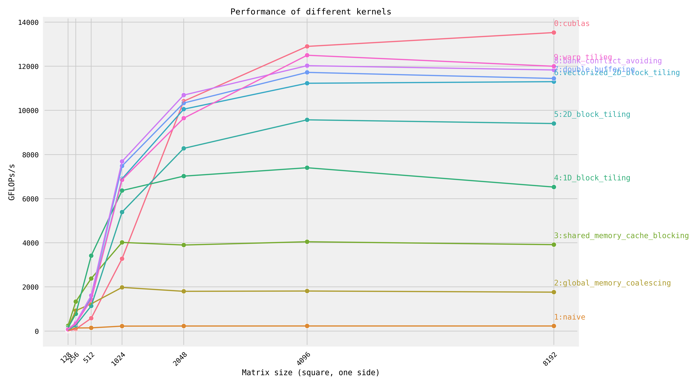

## Introduction

When I was self-learning CUDA programming, I found that it is necessary to work under an environment that manages and compiles the kernels in an efficient way. So I built up this repository under the inspiration of several other repositories on github, especially [SGEMM_CUDA](https://github.com/siboehm/SGEMM_CUDA).

## Usage

### Compile

To compile, run the following commands:
```bash
mkdir build
cd build
cmake ..
make
```

### List valid kernels

To display the list of all valid kernels along with their ids:
```bash
./gemm --list-kernels
```

Valid kernels should be registered in the list `registered_kernel` in `gemm/config.h`.


### Test correctness and performance of kernel(s)

In this code repository, we provide features for testing the correctness and performance(latency) of the implemented matrix kernels. These tests need to trigger the kernel for multiple times.

To do these tests, just following the steps below:

First set the sizes of matrices A, B, C in variable `mnk_list` of file `./gemm/config.h`, and compile again. `mnk_list` records all the sets of sizes you want to test.

Then, dependent on whether you want to test the correctness and performance on all kernels or one of them:

To run tests on all GEMM kernels, execute

```bash
DEVICE=[device_id] ./gemm
```
Here the device_id of gpu is 0 by default.

To run tests on one specific kerenel, execute
```bash
DEVICE=[device_id] ./gemm [kernel_idx]
```
Here the kernel_idx should be valid.


### Plot the profiling results of all kernels:

First move into the build directory, and run profiling on all kernels:
```bash
cd ./build
DEVICE=[device_id] ./gemm > result.log
```

Then move to the root directory of repository, execute
```bash
pip install -r requirements.txt
python plot_results.py --log_path ./build/result.log --plot_path [OUTPUT_DIRECTORY]/benchmark_result.png
```

Then the plot should appear at the given output path.


### Trigger kernel once without testing

Sometimes we only want to trigger a kernel once. In such cases, you can trigger the kernel once through sending a flag and the sizes of matrices:
```bash
DEVICE=[device_id] ./gemm --once [kernel_idx] [M] [N] [K]
```

For example, when using nsight compute to profile a kernel, just use following command:
```bash
DEVICE=[device_id] ncu -o profile ./gemm --once [kernel_idx] [M] [N] [K]
```


## Benchmark

Results of each kernel running GEMM in different sizes (from 128 to 16384) on NVIDIA Tesla V100-PCIE-32GB:
<!-- benchmark_plot -->

<!-- benchmark_plot -->

The following are each kernel's performance of running 4096x4096 GEMM on Nvidia Tesla V100-PCIE-32GB:

<!-- benchmark_results -->
|Idx| Kernel                           |  GFLOPs/s | Performance relative to cuBLAS |
|:--|----------------------------------|----------:|:-------------------------------|
| 1 | Naive                            |   `228.7` | 1.77%                          |
| 2 | Global Memory Coalescing         |  `1812.6` | 14.05%                         |
| 3 | Shared Memory Cache Blocking     |  `4045.3` | 31.40%                         |
| 4 | 1D Block Tiling                  |  `7399.9` | 57.36%                         |
| 5 | 2D Block Tiling                  |  `9571.4` | 74.20%                         |
| 6 | Vectorized 2D Block Tiling       | `11228.9` | 87.05%                         |
| 7 | Double Buffering                 | `11722.1` | 90.87%                         |
| 8 | Bank Conflict Avoiding           | `12025.9` | 93.23%                         |
| 9 | Warp Tiling                      | `12498.6` | 96.89%                         |
| 0 | cuBLAS                           | `12899.8` | 100.00%                        |
<!-- benchmark_results -->

## Reference

### Nvidia Documents
[Cuda C++ Programming Guide](https://docs.nvidia.com/cuda/cuda-c-programming-guide/index.html)

[Cuda C++ Best Practices Guide](https://docs.nvidia.com/cuda/cuda-c-best-practices-guide/)

[Nvidia Cutlass Blog](https://developer.nvidia.com/blog/cutlass-linear-algebra-cuda/)

### Github Projects

[SGEMM_CUDA](https://github.com/siboehm/SGEMM_CUDA) by [siboehm](https://github.com/siboehm) (This tutorial is really awesome!)

[Cuda Tutorial](https://cuda.keter.top/) by [PaddleJitLab](https://github.com/PaddleJitLab)

[cuda-sgemm-optimization](https://github.com/YangLinzhuo/cuda-sgemm-optimization) by [yanglinzhuo](https://github.com/YangLinzhuo)

[Cuda Learning Material](https://github.com/ifromeast/cuda_learning.git) by [ifromeast](https://github.com/ifromeast)